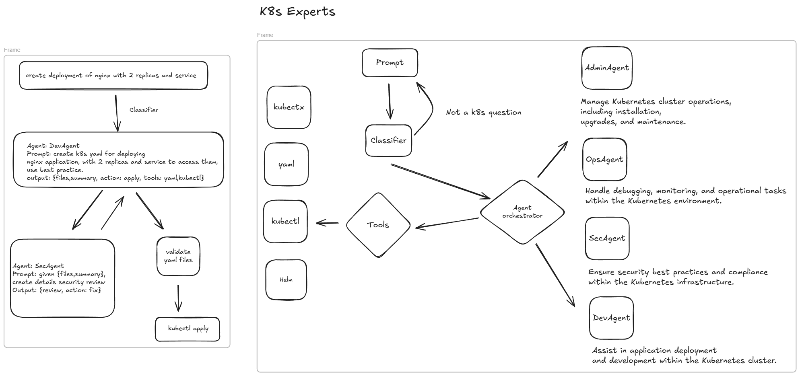

# Kubernetes Multi-Agent AI Experts

## Overview

This project aims to create a multi-agent AI system specializing in Kubernetes (K8s) expertise. Each agent is dedicated to a specific domain within Kubernetes, ensuring precise, actionable responses. The system leverages multiple small, fine-tuned models to provide domain-specific solutions, such as cluster management, security, debugging, and deployment automation.

The ultimate goal is to develop an AI-powered assistant capable of passing Kubernetes certification exams and assisting users in real-world K8s scenarios.

## Architecture

The system consists of the following core components:

1. **Classifier Agent**: Identifies the intent of the user query and determines which specialized agents should handle the request.
2. **Specialized Agents**:
   - **AdminAgent**: Manages Kubernetes cluster operations, including installation, upgrades, and maintenance.
   - **OpsAgent**: Handles debugging, monitoring, and operational tasks within the Kubernetes environment.
   - **SecAgent**: Ensures security best practices and compliance within the Kubernetes infrastructure.
   - **DevAgent**: Assists in application deployment and development within the Kubernetes cluster.
3. **Agent Orchestrator**: Manages the interaction between agents and tools, ensuring smooth communication and execution of tasks.
4. **Execution Layer**: Uses tools like `kubectl`, YAML generation, and Helm to perform real-world operations.



### Flow

- The user submits a prompt (e.g., *"Create a deployment of Nginx with 2 replicas and a service"*).
- The **Classifier Agent** determines the relevant experts (e.g., DevAgent for generating YAML and SecAgent for security review).
- The **Agent Orchestrator** invokes the necessary agents in the correct sequence.
- Each agent processes the task, generating structured JSON output.
- The Execution Layer applies the changes if required (e.g., running `kubectl apply`).

## Model Training Strategy

Each agent will be trained on a domain-specific dataset:

- **AdminAgent**: Kubernetes cluster lifecycle management, kubeadm, upgrades, backups.
- **OpsAgent**: Logs analysis, Prometheus/Grafana monitoring, debugging failures.
- **SecAgent**: Pod Security Standards (PSS), network policies, RBAC configurations.
- **DevAgent**: Writing Kubernetes manifests, Helm charts, CI/CD best practices.

We will use **Ollama's LLaMA 3.2** for inference and fine-tune smaller models per agent.

## Interaction and Execution

The system is interactive and can execute commands based on user queries:

1. The user asks a question (e.g., *"Create a secret in namespace `dev` with value `x`"*).
2. The **Classifier Agent** determines that the request should be handled by the **DevAgent**.
3. The **DevAgent** generates the required `kubectl` command:
   ```bash
   kubectl create secret generic my-secret --from-literal=value=x -n dev
   ```
4. The Execution Layer runs the command if execution mode is enabled.

## Future Enhancements

- Fine-tune models per agent domain for better accuracy.
- Introduce a feedback loop to improve agent recommendations.
- Expand to support multi-cloud Kubernetes environments (AWS EKS, GKE, AKS).

This project lays the foundation for an advanced AI-powered Kubernetes assistant, capable of simplifying and automating complex Kubernetes tasks.
